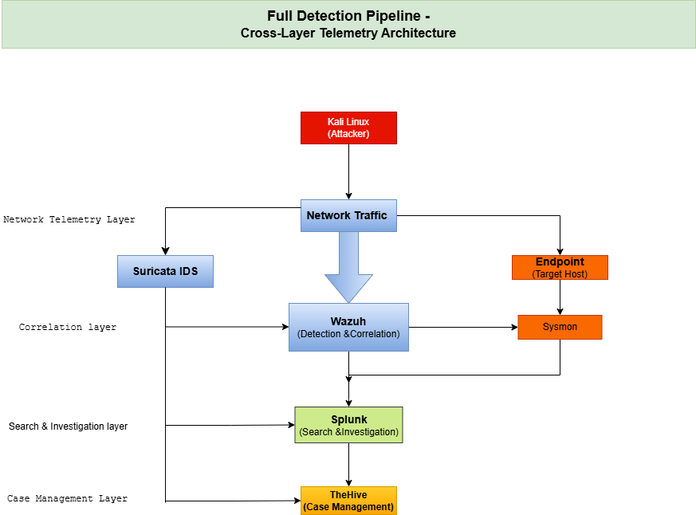

# Full Detection Pipeline Lab

Cross-layer SOC detection pipeline engineered to detect, correlate, and investigate attack activity across network, endpoint, and SIEM layers.

**Stack:** Suricata • Sysmon • Wazuh • Splunk • TheHive

**Validated Use Case:** Nmap reconnaissance activity traced from attack execution to SIEM investigation.


---

## Executive Summary

Modern attacks generate signals across multiple layers, yet many environments still investigate alerts in isolation.

This project demonstrates how a modern SOC can:

- Detect suspicious activity at the network layer  
- Validate endpoint behavior through telemetry  
- Correlate alerts in a SIEM pipeline  
- Investigate events in Splunk  
- Prepare incidents for case management workflows  

The result is an end-to-end detection workflow aligned with real-world blue team operations.

---

## Why This Project Matters

Single-source detections create blind spots.

This lab validates how one attack chain can be observed from multiple perspectives:

- **Network Visibility** → reconnaissance / suspicious traffic  
- **Endpoint Visibility** → processes / command execution  
- **SIEM Visibility** → normalized alerts / searchable evidence  
- **Operational Visibility** → investigation continuity  

### CIA Triad Alignment

- **Confidentiality** — detect credential access and unauthorized activity  
- **Integrity** — validate alert accuracy and log fidelity  
- **Availability** — preserve investigation workflows and searchable logs 

---

## Table of Contents

- [Executive Summary](#executive-summary)
- [Why This Project Matters](#why-this-project-matters)
- [Architecture](#architecture)
- [Project Objectives](#project-objectives)
- [Detection Pipeline Components](#detection-pipeline-components)
- [Phase 1 Attack Scenario](#phase-1-attack-scenario)
- [Expected Detection Flow](#expected-detection-flow)
- [Detection Validation Evidence](#detection-validation-evidence) 
- [Technologies Used](#technologies-used)
- [Repository Structure](#repository-structure)
- [MITRE ATT&CK Mapping](#mitre-attck-mapping)
- [Project Ownership](#project-ownership)
- [Project Status](#project-status)
- [Project Roadmap](#project-roadmap)
- [Future Enhancements](#future-enhancements)
- [Skills Demonstrated](#skills-demonstrated)
- [Author](#author)
- [License](#license)

---

## Architecture

This project uses a **cross-layer detection pipeline**:



---

## Project Objectives

This lab focuses on:

- Cross-layer detection engineering  
- Telemetry correlation  
- SOC workflow simulation  
- Detection validation  
- Incident investigation  

---

## Detection Pipeline Components

### Network Detection — Suricata

Suricata monitors network traffic and detects:

- Suspicious connections  
- Port scanning  
- SSH attempts  
- Lateral movement behavior  
- Suspicious traffic patterns  

---

### Endpoint Telemetry — Sysmon

Sysmon collects endpoint telemetry including:

- Process creation  
- Network connections  
- Command execution  
- File creation  
- Authentication behavior  

---

### Detection & Correlation — Wazuh

Wazuh aggregates:

- Suricata alerts  
- Sysmon telemetry  
- System logs  

Wazuh performs:

- Detection correlation  
- Alert generation  
- Severity classification  
- MITRE ATT&CK mapping  

---

### Investigation Layer — Splunk

Splunk enables:

- Timeline investigation  
- Event correlation  
- Threat hunting  
- Alert analysis  
- Log searching  

---

### Case Management — TheHive

TheHive simulates SOC case handling:

- Incident creation  
- Alert tracking  
- Analyst workflow  
- Investigation documentation  

---

## Phase 1 Attack Scenario

Phase 1 focuses on:

**Discovery → Credential Access**

### Discovery Commands

```bash
whoami
hostname
netstat
ps aux
```

---

### Credential Access Simulation

- sudo attempts  
- failed login attempts  
- credential file access  

---

## Expected Detection Flow

| Layer | Detection |
|------|-----------|
| Suricata | Network activity |
| Sysmon | Endpoint behavior |
| Wazuh | Correlated alerts |
| Splunk | Investigation |
| TheHive | Case creation |

---

---

## Detection Validation Evidence

This section provides visual proof of attack simulation, telemetry detection, SIEM ingestion, and cross-layer investigation workflows.

### Cross-Layer Detection Timeline

Attack activity traced across multiple layers of the detection pipeline.


---

### Attack Simulation (Kali Linux)

Controlled reconnaissance activity executed from attacker node.


---

### Suricata Detection

Network-layer telemetry captured suspicious scan activity.


---

### Wazuh Correlation

Correlated alert generated from ingested security telemetry.


---

### Splunk Ingestion

Wazuh alerts successfully forwarded into Splunk for investigation.


---

### Splunk HEC Pipeline Validation

HTTP Event Collector integration validated successfully.


---

## Technologies Used

- Kali Linux  
- Suricata IDS  
- Sysmon  
- Wazuh  
- Splunk Enterprise  
- TheHive  
- VirtualBox  
- Linux  

---


## Repository Structure

```text
Full-Detection-Pipeline-Lab/
│
├── README.md
├── architecture/
│   ├── architecture-diagram.png
│   └── telemetry-flow.md
│
├── attack-simulation/
│   └── attack-flow.md
│
├── network-detection/
│   └── suricata-analysis.md
│
├── endpoint-detection/
│   └── sysmon-analysis.md
│
├── siem-correlation/
│   └── wazuh-correlation.md
│
├── investigation/
│   └── splunk-analysis.md
│
├── case-management/
│   └── thehive-workflow.md
│
├── mitre/
│   └── attack-mapping.md
│
├── artifacts/
│   └── screenshots/
│
└── docs/
    └── project-notes.md
```

---

## MITRE ATT&CK Mapping

This project maps detections to:

- T1087 — Account Discovery  
- T1033 — System Owner Discovery  
- T1049 — Network Connections Discovery  
- T1110 — Brute Force  
- T1078 — Valid Accounts  

---

## Project Ownership

Designed and engineered as an independent detection engineering lab.


## Detection Validation Evidence


### Roles

### Network & Detection Pipeline

- Suricata  
- Wazuh  
- Telemetry Flow  
- Architecture  

### Endpoint & Investigation

- Sysmon  
- TheHive  
- Investigation Workflow  

---

## Project Status

| Phase | Status |
|------|--------|
| Architecture | Complete |
| Splunk HEC Integration | Complete |
| Attack Simulation | Complete |
| Detection Validation | In Progress |

---

## Project Roadmap

### Phase 1

- Cross-layer detection architecture  
- Discovery → Credential Access simulation  

### Phase 2

- Detection correlation validation  
- Investigation workflow  

### Phase 3

- MITRE ATT&CK mapping  
- Documentation  

### Phase 4

- Automation (n8n + AI)  
- SOC triage pipeline  

---

## Future Enhancements

- Splunk automation  
- n8n automation workflows  
- AI-powered alert triage  
- Cloud telemetry (AWS / Azure)  
- Threat hunting dashboards  

---

## Skills Demonstrated

- Detection Engineering  
- SIEM Architecture  
- Telemetry Correlation  
- SOC Workflow Design  
- Threat Detection  
- Incident Response  
- Blue Team Engineering  

---

## Author

**Esla Kwanza**  
Security Engineer | Detection Engineering | SOC Operations | Cloud Security 

GitHub:  
https://github.com/kesleeNcrypto

LinkedIn:
www.linkedin.com/in/esla-kwanza-cybersecurity

---

## License

This project is licensed under the MIT License


