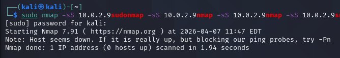
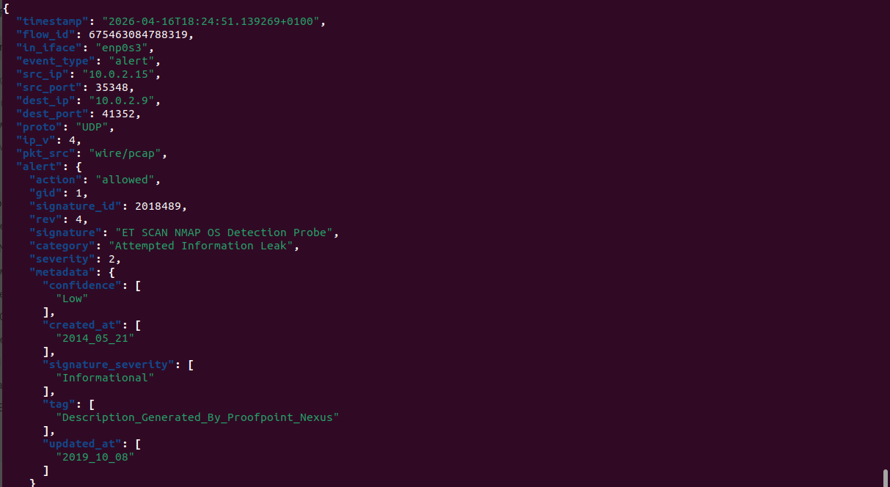
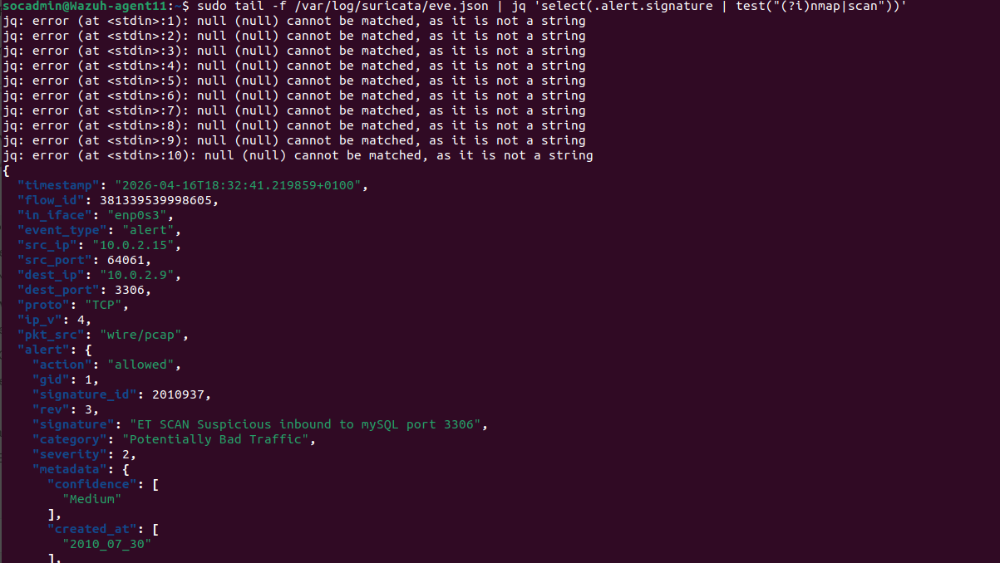
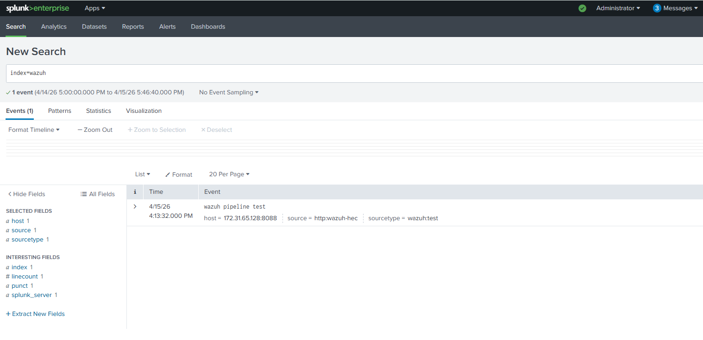

## Detection Validation Evidence

### Cross-Layer Detection Timeline

This timeline demonstrates how a single reconnaissance action was observed across multiple layers of the detection pipeline.

### Individual Evidence

#### Attack Simulation

#### Suricata Detection

#### Wazuh Correlation

#### Splunk Ingestion

